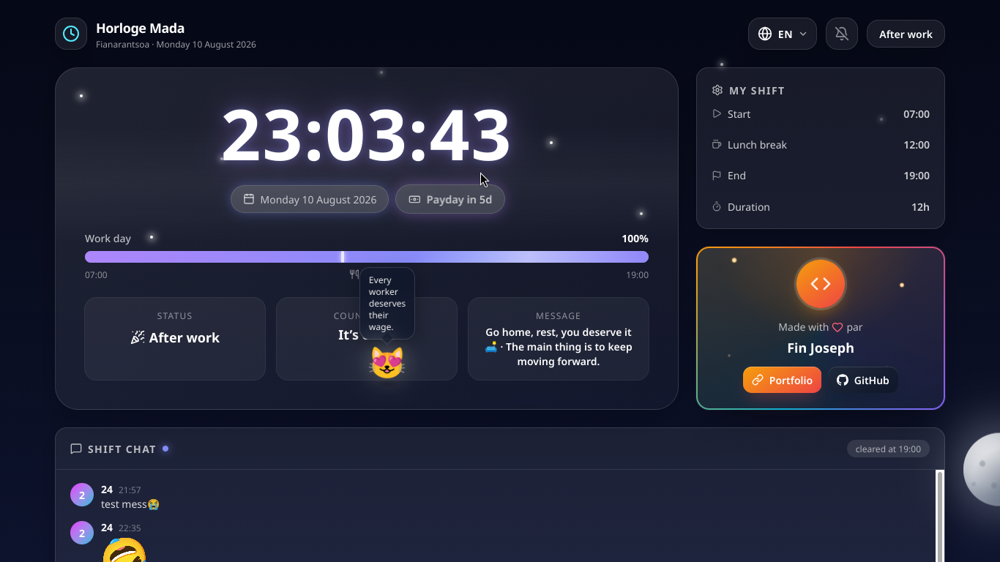

# 🕰️ Horloge Mada

Horloge intelligente du call center — heure officielle de **Madagascar** (Indian/Antananarivo), progression de journée, pause déjeuner, compte à rebours, paie, chat en direct et mascotte chat qui se promène sur toute la page.

Créé avec ❤️ par **Fin Joseph** — [Portfolio](https://finjoseph.onrender.com/) · [GitHub](https://github.com/FinJoseph)

## 📸 Aperçu



## ✨ Fonctionnalités

- 🕒 Heure officielle de Madagascar en temps réel
- 📅 Date et jour de la semaine en 5 langues : 🇫🇷 🇲🇬 🇬🇧 🇮🇳 🇨🇳
- ⏱️ Progression de la journée de travail (07:00 → 19:00)
- 🍽️ Pause déjeuner à 12:00 (1h)
- ⏳ Compte à rebours vers la prochaine étape
- 💰 Compte à rebours de la paie (15 du mois)
- 🌅 Ciel dynamique : aube, jour, crépuscule, nuit — soleil et lune réalistes en 3D
- 🐱 Chat mascotte qui se promène aléatoirement sur toute la page
- 💬 Chat en direct multi-utilisateurs avec emojis, stickers et GIFs animés (Google Noto, sans clé API)
- 🔔 Alarmes sonores (début, pause, reprise, fin de journée)
- 🎨 Effets 3D : tilt au survol des cartes, reflets, écran de chargement

## 🛠️ Stack

- **Laravel 12** + **Livewire 4** (composants SFC)
- **Alpine.js** pour l'interactivité côté client
- **Tailwind CSS v4** + CSS custom (Vite)
- **FrankenPHP** (PHP 8.4) en Docker

## 🚀 Installation

```bash
composer install
npm install
cp .env.example .env
php artisan key:generate
npm run build
php artisan serve
```

Test : `http://127.0.0.1:8000`

## 🧪 Tests

```bash
php artisan test
```

## 🌍 Déploiement

L'application est prête pour plusieurs plateformes :

### Fly.io (recommandé)
```bash
fly launch --dockerfile Dockerfile   # une fois
fly deploy
```

### Render
Pousser vers GitHub, puis créer un service **Web Service** → **Docker** en pointant vers `render.yaml` (Blueprint). Déploiement automatique à chaque push.

### Variables d'environnement
| Variable | Valeur |
|---|---|
| `APP_KEY` | générée |
| `CACHE_STORE` | `file` |
| `SESSION_DRIVER` | `file` |
| `QUEUE_CONNECTION` | `sync` |
| `SHIFT_TIMEZONE` | `Indian/Antananarivo` |
| `SHIFT_START` | `07:00` |
| `SHIFT_LUNCH` | `12:00` |
| `SHIFT_LUNCH_DURATION` | `60` |
| `SHIFT_END` | `19:00` |

## 📄 Licence

MIT
