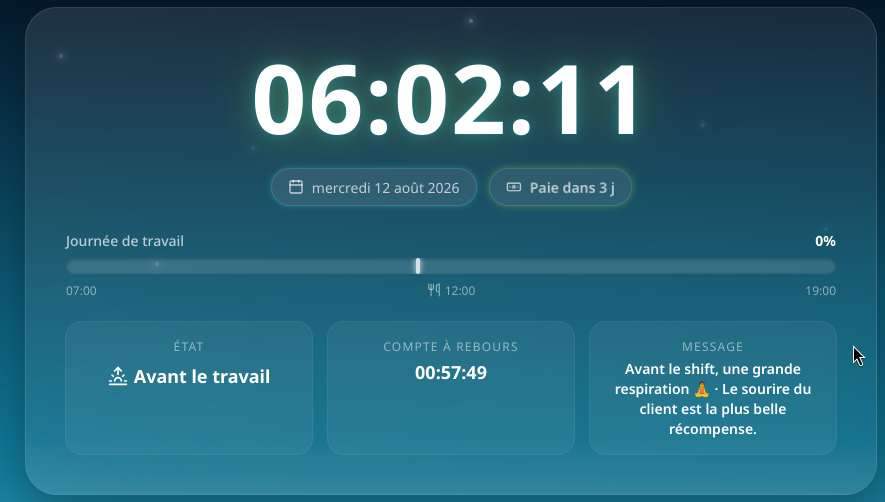
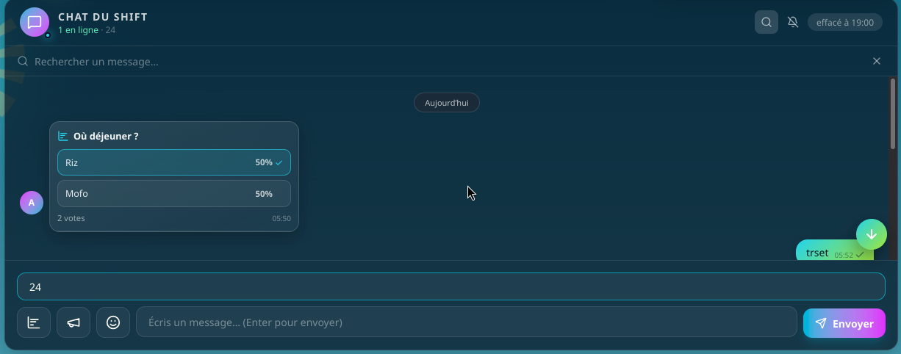
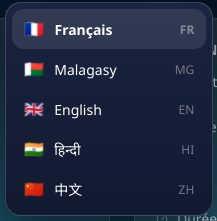
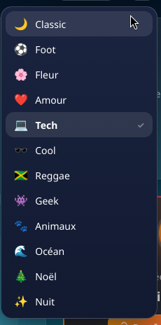

# 🕰️ Horloge Mada

Horloge intelligente du call center — heure officielle de **Madagascar** (Indian/Antananarivo), progression de journée ultra-précise, pause déjeuner, compte à rebours, paie, chat en direct, **mini-jeux** et mascotte chat qui se promène sur toute la page.

Créé avec ❤️ par **Fin Joseph** — [Portfolio](https://finjoseph.onrender.com/) · [GitHub](https://github.com/FinJoseph)

## 📸 Aperçu


### Galerie

| Horloge | Chat en direct |
|---|---|
|  |  |

| Sélecteur de langue | Sélecteur de thème |
|---|---|
|  |  |

## ✨ Fonctionnalités

- 🕒 Heure officielle de Madagascar en temps réel (API `GET /api/time` synchronisée, indépendante du PC)
- 📅 Date et jour de la semaine en 5 langues : 🇫🇷 🇲🇬 🇬🇧 🇮🇳 🇨🇳
- 🎨 12 thèmes visuels (Classic, Foot, Fleur, Amour, Tech, Cool, Reggae, Geek, Animaux, Océan, Noël, Nuit), chacun avec sa mascotte
- ⏱️ Progression de la journée de travail (07:00 → 19:00) **au millième de % près** (mise à jour en continu)
- 🍽️ Pause déjeuner à 12:00 (1h)
- ⏳ Compte à rebours vers la prochaine étape
- 💰 Compte à rebours de la paie (15 du mois)
- 🌅 Ciel dynamique : aube, jour, crépuscule, nuit — soleil et lune réalistes en 3D
- 🐱 Chat mascotte qui se promène aléatoirement sur toute la page
- 💬 Chat en direct multi-utilisateurs : emojis, **stickers (Tenor + Klipy + emojis)**, GIFs animés, **sondages (12 options, pourcentages précis)**, réactions, réponses, édition, suppression, recherche, annonces, présence en ligne et indicateur de frappe
- 🎮 **Mini-jeux** (`/jeux`) : ⌨️ **Dactylo Arcade** (3 modes : Course, Survie, Défi WPM — 5 niveaux, 4 styles d'arène, règles et records), 🔤 Anagrammes, 🧺 Panière à lettres, ✊ Pierre-papier-ciseaux, ⭕ Morpion (IA), 🧠 Mémoire, 🐍 Serpent
- ⚙️ Menu Paramètres unifié : langue, fuseau horaire, thème et son regroupés dans un seul bouton
- 📡 API émojis : `GET /api/emojis` — 3953 émojis (recherche, catégories, teints de peau, pagination, hex pour les images Noto)
- 🔔 Alarmes sonores (début, pause, reprise, fin de journée)
- 🎨 Effets 3D : tilt au survol des cartes, reflets, écran de chargement

## 🛠️ Stack

- **Laravel 13** + **Livewire 4** (composants SFC)
- **Alpine.js** pour l'interactivité côté client
- **Tailwind CSS v4** + CSS custom (Vite)
- **FrankenPHP** (PHP 8.4) en Docker

## 🚀 Installation

```bash
composer install
npm install
cp .env.example .env
php artisan key:generate
npm run build
php artisan serve
```

Test : `http://127.0.0.1:8000`

## 🧪 Tests

```bash
php artisan test
```

## 🌍 Déploiement

L'application est prête pour plusieurs plateformes :

### Fly.io (recommandé)
```bash
fly launch --dockerfile Dockerfile   # une fois
fly deploy
```

### Render

Le dépôt contient un **Blueprint `render.yaml`** à la racine : Render détecte la config, construit l'image Docker (FrankenPHP) et déploie automatiquement à chaque push.

1. **Pousser** le projet sur GitHub (déjà fait : `https://github.com/FinJoseph/horloge-mada`).
2. Sur [render.com](https://dashboard.render.com/), **New → Blueprint**.
3. Choisir le repo `horloge-mada` → Render lit `render.yaml` et crée le service **Web Service** `horloge-mada`.
4. **APP_KEY** est générée automatiquement (`generateValue: true`), les autres variables (`SHIFT_*`, `APP_URL`, …) sont déjà déclarées dans le blueprint.
5. **Apply / Deploy** → l'application est disponible sur `https://horloge-mada.onrender.com`.

- Healthcheck : `GET /up` → `{"status":"ok"}`.
- Plan **free** : l'instance s'endort après 15 min d'inactivité et se réveille au premier accès (première requête lente).
- Chat & sessions stockés en cache **fichier** : réinitialisés à chaque redémarrage (éphémère par conception, la TTL du chat expire chaque soir à 19:00).
- Si le déploiement échoue : consulter l'onglet **Logs** ; le conteneur échoue vite (le `docker-entrypoint.sh` est en `set -e`).
- Le nom du service définit l'URL publique → si `horloge-mada` est pris, adapter la valeur `APP_URL` dans `render.yaml`.

### Variables d'environnement
| Variable | Valeur |
|---|---|
| `APP_KEY` | générée |
| `CACHE_STORE` | `file` |
| `SESSION_DRIVER` | `file` |
| `QUEUE_CONNECTION` | `sync` |
| `SHIFT_TIMEZONE` | `Indian/Antananarivo` |
| `SHIFT_START` | `07:00` |
| `SHIFT_LUNCH` | `12:00` |
| `SHIFT_LUNCH_DURATION` | `60` |
| `SHIFT_END` | `19:00` |
| `TENOR_API_KEY` | clé gratuite [Tenor](https://tenor.com/developer/keyregistration) (stickers du chat) |
| `KLIPY_API_KEY` | clé gratuite [Klipy](https://partner.klipy.com) (GIFs du chat) |

> 💡 Stickers du chat : les emojis/klipy fonctionnent sans clé ; Tenor est un bonus si une clé est fournie.

## 📄 Licence

MIT
